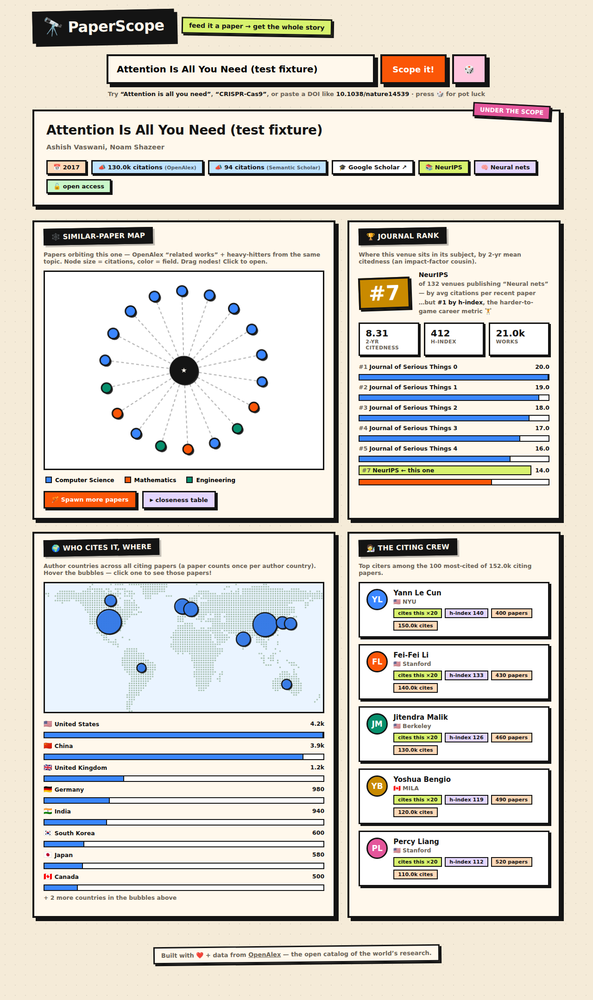

# PaperScope 🔭

**Feed it a paper → get the whole story.**

A single-file web app for paper analytics. Type a paper title (with live autocomplete) or paste a DOI, and PaperScope builds a neo-brutalist dashboard around it:

- 🕸️ **Similar-paper map** — an interactive force-directed network of OpenAlex "related works" plus the topic's most-cited papers. Node size = citations, color = subfield (OpenAlex topic hierarchy; falls back to field). Drag nodes, click to open, spotlight a field via the legend, spawn more papers on demand, or flip open a table of all papers ranked by a 0–100 closeness score. **Blend up to 3 seed papers** into one map — each seed anchors its own cluster, with citation bridges between them.
- 🏆 **Journal rank** — the venue's exact rank among all venues in the paper's subject, shown through two lenses: 2-yr mean citedness (impact-factor cousin) and h-index (harder to game). Top-5 leaderboard included.
- 🌍 **Who cites it, where** — a dot-grid world map with clickable bubbles for the author countries of every citing paper, plus a top-8 country list linking to the actual papers.
- 🧑‍🔬 **The citing crew** — profile cards for the most frequent citing authors: institution, country, h-index, works, citations.

Papers carry **FWCI and field-percentile badges** ("top 1% of its field-year"), and everything exports to **BibTeX** — single papers or the whole map at once.

**Author mode** (🧑‍🔬 toggle): type a researcher's name or paste an ORCID for a whole-career dashboard — paper portfolio map with self-citation links, career timeline, top venues, citation trend, fan countries, top citing authors, a self-citation "organic rate," a co-authors tab, a research-journey chart of their subfields over the years, a **🎯 Where Next** venue recommender (impact × topic fit × familiar turf), and **ORCID career chips** (employment + funding) when the registry has them.

**⚔️ Compare mode**: pit two papers or two researchers head-to-head — a tale-of-the-tape with tug-of-war bars, a grouped citations-per-year trend duel, and a reach comparison of citing countries, all shareable via `?vs=` permalinks.

Citation counts are shown from both **OpenAlex** and **Semantic Scholar** (whose broader corpus usually sits closer to Google Scholar's number), with a one-click Google Scholar link. The 🎲 button rolls a random paper from OpenAlex's ~250M-work catalog.



## Run it

Open `index.html` in a browser. That's it — no build, no server, no API keys. Data comes live from the free [OpenAlex](https://openalex.org) and [Semantic Scholar](https://www.semanticscholar.org) APIs.

## Host it

Live at **[paperscope.net](https://paperscope.net)** (Cloudflare Pages, auto-deploys from `main`). It's a static file — any static host serves it as `index.html`.

## Code structure & building

`index.html` is the build artifact — a single self-contained file, committed so the repo stays drop-anywhere deployable. The source of truth lives in `src/`:

```
src/template.html   page shell (markup) with __STYLES__ / __SCRIPT__ tokens
src/styles.css      all styling
src/mapdata.json    embedded world-map grid + country centroids
src/js/01-core.js   helpers, API client (cache + 429 retry), epoch guards, resize registry
src/js/02-mode.js … 10-crew.js   one module per feature area (see build.js MANIFEST)
```

Edit files in `src/`, then `npm run build` (plain Node, zero dependencies) to regenerate `index.html`. The build is a deterministic concatenation — module order is the `MANIFEST` in `build.js`, and modules share one script scope, so declarations are global across files.

## Dev notes

- `dev/test.js` — Playwright smoke test with mocked API fixtures. Run with `npm i playwright && node dev/test.js` (set `FALLBACK=1` to exercise the API-fallback paths). Adjust the `executablePath` / screenshot paths for your machine.
- `dev/genmap.js` — regenerates the embedded dot-grid world map + country centroids from `world-atlas` and `world-countries` (`npm i world-atlas@2 topojson-client world-countries && node dev/genmap.js`), writing `src/mapdata.json`; rebuild to inline it.
- Every remote call has a graceful fallback chain, so a failing endpoint degrades a panel instead of breaking the page.

## Data sources & thanks

[OpenAlex](https://openalex.org) (CC0 scholarly catalog) and [Semantic Scholar](https://api.semanticscholar.org). Map geometry from `world-atlas` (Natural Earth) and `world-countries`.
